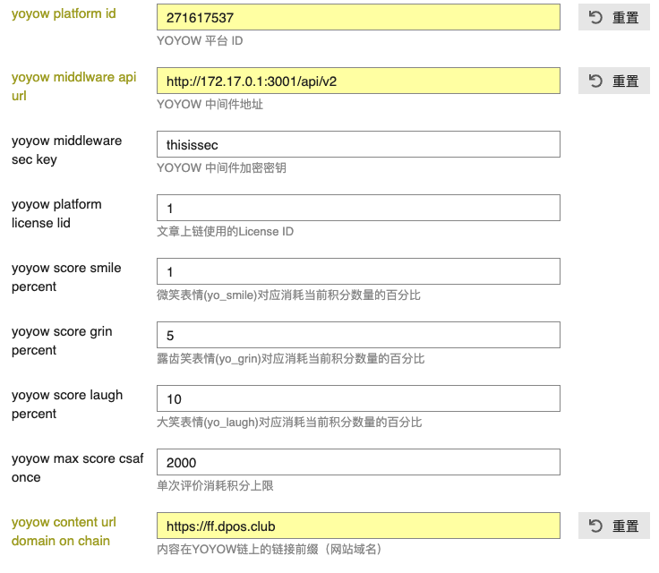
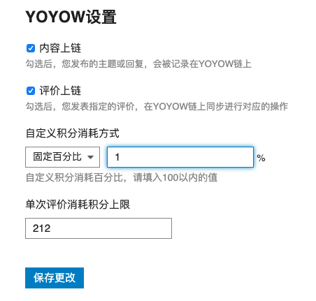

# Discourse YOYOW 插件

Discourse-yoyow 插件是在[retort](https://github.com/gdpelican/retort)基础上修改添加，打通YOYOW与Discourse实现的论坛，为内容上链提供便利，主要包括以下功能：

1. YOYOW登录和YOYOW的账号绑定
2. 发布文章，记录hash值至YOYOW blockchain
3. 在论坛内使用表情对文章进行链上打分

### 插件安装

参考Discourse 的插件安装流程 (https://meta.discourse.org/t/install-a-plugin/19157)

### 管理员配置说明

该插件依赖于yoyow中间件[yoyow-middleware](https://github.com/yoyow-org/yoyow-middleware)，需要提前部署yoyow-middleware，并配置yoyow node连接地址以及协商密钥等信息。

启用discourse-yoyow插件后，需要配置YOYOW上链的相关信息

- 上链使用的平台账号（需要与中间件上配置的平台账号一致）

- yoyow中间件地址

- yoyow中间件的通信密钥

- 内容上链使用的License ID

- 内容上链时，url使用的域名前缀

其他[retort](https://github.com/gdpelican/retort)相关的设置，可以参考retort的官方文档

### 表情的含义

插件预设了4个回应表情

YO_SMILE:

YO_GRIN: 

YO_LAUGH:

YO_CUSTOM: 

使用这4个表情进行点赞，会消耗相应的积分，对上链的文章进行打分。

YO_SMILE，YO_GRIN，YO_LAUGH对应的消耗积分的数量由管理员再后台管理里修改，默认分别对应 1%， 5%， 10%。

YO_CUSTOM对应使用积分的数量可以由用户自己设置，可以选择是消耗固定积分，或者消耗一定比例的积分。

用户可以在个人“设置”-->“账户”里绑定或者解绑YOYOW账户;

在 “设置”--> “个人信息” 里配置是否允许上链，消耗积分模式和数量，以及消耗最大值等设置。

